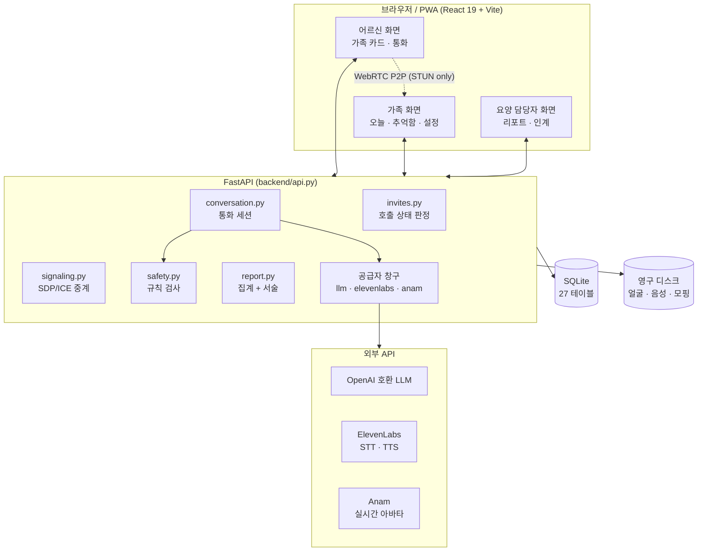
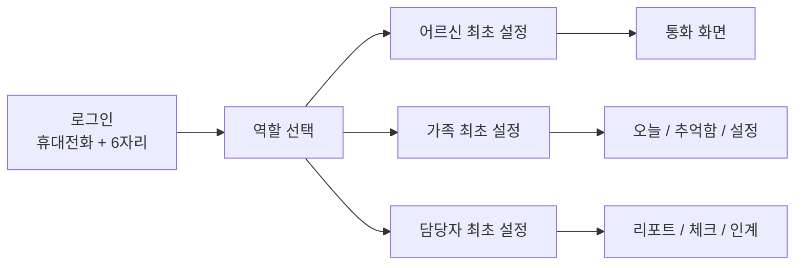
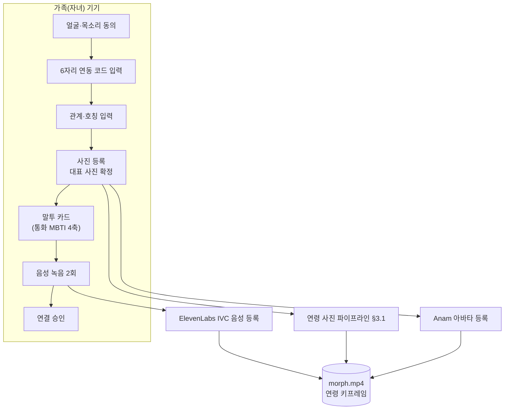
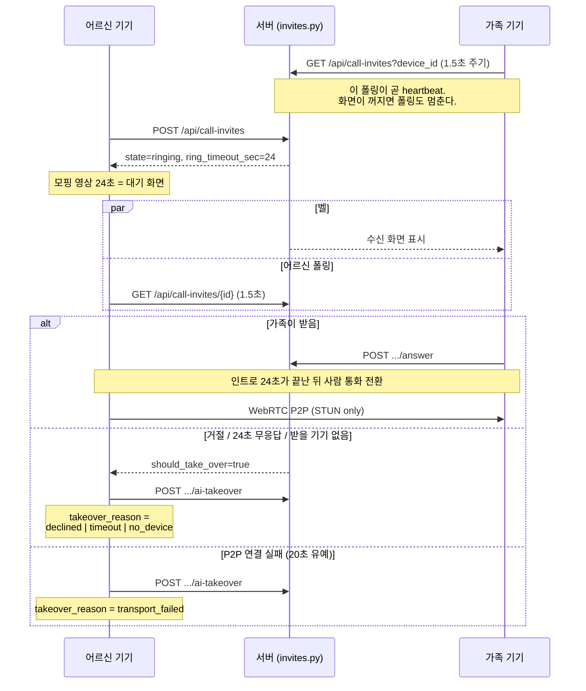
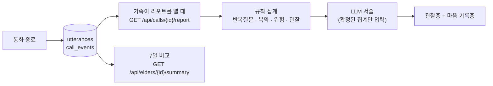
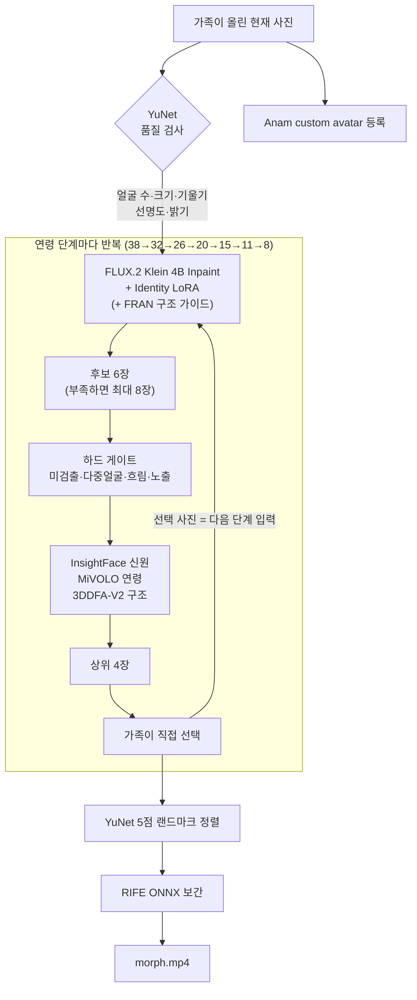
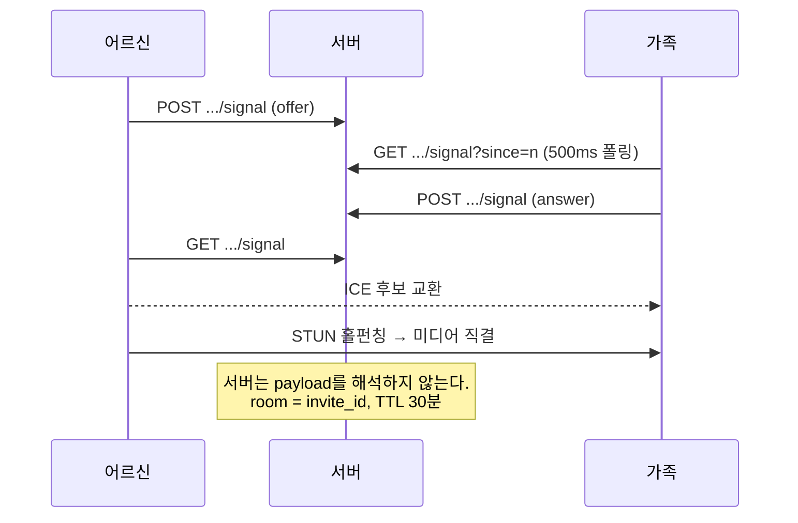
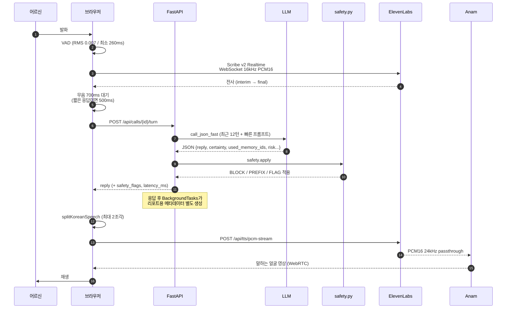
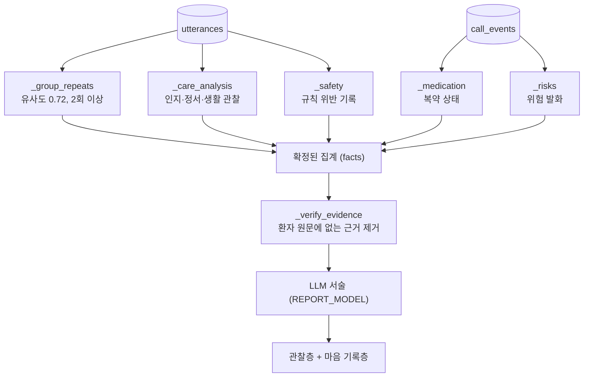

# 기술 파이프라인과 사용자 플로우

이 문서는 **무엇이 언제 실행되는지**를 하나의 기준으로 고정한다.
서비스의 "왜"는 [`service_definition.md`](service_definition.md), 기능 목록과
설계 결정은 [`../CLAUDE.md`](../CLAUDE.md), 실행 방법은
[`../README.md`](../README.md)를 본다.

읽는 순서는 다음과 같다.

1. 시스템 전체 구조 (§1)
2. 사용자 플로우 — 사람이 겪는 순서 (§2)
3. 기술 파이프라인 — 기계가 겪는 순서 (§3)
4. 기술별 적용 시점 표 (§4)
5. 지연 예산과 실패 폴백 (§5, §6)

---

## 1. 시스템 전체 구조



핵심 규칙 세 가지가 이 그림을 결정한다.

- **외부 공급자는 각각 단일 창구를 갖는다.** LLM은 `backend/llm.py`, 음성은
  `backend/elevenlabs_tts.py` / `backend/elevenlabs_stt.py`, 아바타는
  `backend/anam.py`, 사람 통화 미디어는 `frontend/src/callTransport.js`.
  공급자를 갈아끼울 때 고칠 파일이 하나여야 한다.
- **영구 키는 서버 밖으로 나가지 않는다.** 브라우저가 받는 것은 단기 토큰뿐이다
  (ElevenLabs 단일 사용 토큰 15분, Anam 세션 토큰).
- **판정은 서버가 한다.** "받지 않았다", "이 답변은 규칙 위반이다", "반복 질문
  3회"는 전부 서버 계산이다. 클라이언트 타이머와 모델 신고값은 근거가 아니다.

---

## 2. 사용자 플로우

### 2.0 전체 여정



한 계정이 여러 역할을 가질 수 있다. 역할별 진행 단계는 `user_role_onboarding`
테이블에 즉시 저장되므로 앱을 닫아도 그 단계부터 이어진다
(`backend/api.py:724` `/api/onboarding/{role}`).

로그인은 휴대전화 번호 + 숫자 6자리 간편번호다. 간편번호는 PBKDF2 해시로,
세션 토큰은 원본 대신 SHA-256 해시로 저장한다(`backend/accounts.py`).
**SMS 소유권 확인은 아직 연결되지 않았고** `phone_verified_at`을 별도 컬럼으로
분리해 두었다. 외부 이용자를 받기 전 반드시 채워야 하는 자리다.

### 2.1 준비 단계 — 통화 전에 미리 끝나 있어야 하는 것

이 단계가 통화 품질의 대부분을 결정한다. **통화 중에는 아무것도 생성하지 않는다.**



- **연동 코드**는 가족이 발급하고 어르신 기기에 입력한다. 30분 유효, 1회용
  (`backend/linking.py`). 치매가 있는 분이 아이디·비밀번호를 입력할 수 없다는
  것이 이 설계의 이유다.
- **말투 카드**는 4축(`C/B` 차분·밝음, `E/P` 공감·실용, `M/O` 추억·현재,
  `L/G` 경청·안내) 선택이며, 결과는 성격 진단이 아니라 **프롬프트의 시작점**이다
  (`frontend/src/callStyle.js`). 실제 통화에서는 환자 발화·등록된 사실·안전
  정책이 언제나 유형보다 우선한다.
- **음성**은 ElevenLabs IVC로 즉시 등록되고, 이후 녹음은 가족별 비공개 폴더에
  누적해 PVC 진행도(30분/60분)만 계산한다. PVC 생성·본인 인증은 사용자 확인이
  필요한 별도 단계라 시스템이 임의로 시작하지 않는다(`backend/persona_voice.py`).

### 2.2 통화 플로우 — 세 갈래

어르신이 가족 카드를 누른 순간부터의 흐름이다. **어르신 화면은 세 갈래를
구분하지 않는다.** 어떤 경로든 같은 응답 형태로 통화가 열린다
(`backend/api.py:1751` `_open_ai_session`).



여기서 놓치면 안 되는 설계 결정.

- **"받지 않았다"는 서버가 판정한다.** 벨은 `call_invites` 행이고, 타임아웃은
  조회 시점에 확정한다(lazy expiry, `backend/invites.py:189`). 상주 스케줄러를
  두지 않는 이유는 Render 무료 인스턴스가 유휴 상태에서 잠들기 때문이다.
- **시간 계산이 실패하면 만료로 본다.** `_elapsed()`가 파싱 실패에 `inf`를
  돌려준다. 이 서비스에서 "AI가 대신 받는다"는 정상 동작이고 "어르신이 벨
  화면에 갇힌다"는 사고이므로, 실패는 항상 AI 쪽으로 떨어뜨린다.
- **24초는 인트로 길이와 같다**(`INTRO_DURATION_SEC`). 가족이 중간에 받아도 이
  구간이 끝난 뒤 사람 통화로 전환한다. 양쪽 기기가 같은 서버 값을 보므로
  타이머가 엇갈리지 않는다.
- **heartbeat은 화면이 꺼지면 같이 꺼진다.** 폴링이 곧 "지금 받을 수 있다"는
  신고이기 때문이다. 잠긴 폰이 계속 신고하면 서버는 받을 사람이 있다고 믿고
  벨을 끝까지 울린다. 어느 기기가 살아 있는지는 `GET /api/devices`로 본다.
- **AI가 왜 대신 받았는지가 남는다.** `state`는 `ai_takeover` 하나로 덮이므로
  `takeover_reason`(`declined` / `timeout` / `no_device` / `transport_failed`)을
  따로 보관해야 보호자 리포트가 "거절 3건 / 무응답 5건"을 구분할 수 있다.

### 2.3 통화 후



리포트는 통화가 끝나는 시점이 아니라 **보호자가 열어볼 때** 생성한다
(`backend/api.py:2073`). 종료를 기다리게 하지 않기 위해서다.

---

## 3. 기술 파이프라인

### 3.1 얼굴 연령 파이프라인 — 등록 시 1회, 오프라인

통화 중에는 실행되지 않는다. 응답마다 영상을 생성하면 건당 수백 원에 1~3분이
걸려 대화가 성립하지 않는다.



- **성인에서 8세로 직접 내려가는 경로는 제거했다.** 신원과 아동 구조가 모두
  불안정했다. 인접 단계만 밟는다.
- **FRAN 출력은 완성 사진이 아니다.** FLUX의 생성 방향을 보조하는 내부 구조
  가이드이며 후보 화면에 절대 노출하지 않는다.
- **추천 이유는 LLM이 만들지 않는다.** 수치 차이로 조립한다
  ("목표 8세에 가장 가까운 후보" 등).
- **paired-age LoRA(300 step)는 제품에 승격하지 않았다.** 홀드아웃 인물에서
  신원 유사도 `+0.00459`, 연령 오차 `-0.17세`로 실질 개선이 아니었다. 상세는
  [`face_aging_system.md`](face_aging_system.md).

### 3.2 사람↔사람 통화 파이프라인



**관리형 SFU(LiveKit 등)를 쓰지 않는 이유**는 이 앱에서 연결 실패가 장애가
아니라 "AI가 대신 받는다"는 정상 동작이기 때문이다. SFU가 파는 가치(연결
보장)를 살 이유가 없다. 근거와 뒤집는 조건은
[`call_transport_decision.md`](call_transport_decision.md).

화면은 `connect` / `disconnect` / `onStateChange` 세 가지만 본다.
`failed`가 오면 조건 없이 AI 통화로 폴백한다. 통화 화면 여기저기에
`RTCPeerConnection`을 흩뿌리면 발표장 네트워크에서 안 붙었을 때 갈아탈 수 없다.

### 3.3 AI 통화 한 턴 — 실시간 루프

여기가 이 서비스의 심장이다. 한 턴에 여섯 개의 기술이 순서대로 개입한다.



각 구간을 자세히 본다.

**① 음성 인식 (ElevenLabs Scribe v2 Realtime)**
브라우저는 `/api/stt/realtime-token`으로 **단일 사용 토큰**만 받는다(15분 만료,
연결 시 소모). 영구 API 키는 서버에 남는다. 오디오는 16kHz로 리샘플링해
PCM16 base64로 WebSocket에 흘린다(`frontend/src/useRealtimeTranscription.js`).

어떤 엔진을 쓸지는 **실패 순서가 아니라 기기로 먼저 갈린다**
(`useSpeech.js:170`). Android Chrome은 `webkitSpeechRecognition`이 존재하는데도
결과 없이 종료되는 경우가 있어 처음부터 서버 STT를 쓴다. 데스크톱 Chrome은
브라우저 Web Speech를 쓴다. 서버 STT 안에서만 실패 연쇄가 있다 —
실시간 WebSocket이 끊기거나 최종 전사가 6초(`COMMIT_TIMEOUT_MS`) 안에 오지
않으면 MediaRecorder로 받아 둔 조각을 `/api/stt`에 올린다. (코드의
`gemini-fallback` 이라는 이름은 예전 것이다. 지금 `/api/stt`는 ffmpeg로 WAV
정규화 후 ElevenLabs `scribe_v2`를 호출하고, **원본 음성은 저장하지 않는다**.)

발화 경계는 세 개의 상수로 판정한다.
- `MIN_START_THRESHOLD = 0.007` — 이 RMS를 넘어야 발화 시작
- `MIN_VOICE_MS = 260` — 이보다 짧으면 잡음으로 버린다
- `DEFAULT_SILENCE_MS = 700` — 이만큼 조용하면 턴 종료

여기에 `adaptiveSilenceDelay()`가 붙는다. `"응"`, `"먹었어"` 같은 짧고 확실한
대답은 700ms를 기다릴 이유가 없어 500ms로 줄인다. **어르신의 긴 호흡은 그대로
두고 확실한 짧은 답만 줄이는 것**이 이 함수의 전부다.

**② 답변 생성 (OpenAI 호환 LLM)**
`build_fast_system_prompt()`가 페르소나 템플릿에 등록된 기억·일정·현재
시각·복약 상태를 채워 넣는다. 최근 12턴만 보낸다(`MAX_HISTORY_TURNS`) —
반복 질문이 많아 문맥이 금방 길어지기 때문이다.

응답은 반드시 JSON이다. `reply`만 받으면 안전 검사를 텍스트 매칭으로만 해야
한다. 모델이 `used_memory_ids` / `certainty` / `risk` / `medication_status`를
스스로 신고하게 하면 검사가 정확해지고 리포트 데이터가 공짜로 나온다.
다만 **모델 신고값은 신뢰하지 않는다** — `eval.py`의 `reply_must_not_match`가
실제 문장을 정규식으로 검사한다.

`prohibited` 기억(고인, 가족 갈등)도 프롬프트에 넣는다. 빼면 모델이 근거 없이
지어낸다. 넣고 취급 방법을 명시해야 정책대로 대응한다.

**③ 안전 검사 (safety.py) — 2차 방어**
프롬프트가 1차 방어(부탁)라면 여기는 2차 방어(강제)다. 모델을 바꿔도 이 층의
동작은 변하지 않는 것이 핵심이다. 11개 `Rule`과 5개 `ContextRule`이 있다.

| 처리 | 의미 | 예 |
|---|---|---|
| `BLOCK` | 응답 전체를 안전 문장으로 교체 | `PROMISE_WITHOUT_SCHEDULE`, `MEDICATION_INSTRUCTION`, `FINANCIAL` |
| `PREFIX` | 앞에 불확실성 표현을 덧붙임 | 미확인 기억을 사실처럼 말할 때 |
| `FLAG` | 기록만 남기고 통과 | 리포트에서 근거로 쓴다 |

`ContextRule`은 반대 방향이다. **"이런 발화에는 이런 요소가 반드시 들어가야
한다"**를 검사한다 — 정체성을 직접 물었는데 설명이 없거나
(`IDENTITY_UNEXPLAINED`), 고인 이야기가 나왔는데 처리하지 않으면
(`DECEASED_UNHANDLED`) 걸린다. 맥락 제공 기능을 넓힐 때 안전을 지키는 자리가
여기다.

**④ 리포트 메타데이터 — 응답 이후**
`intent`, `care`, `medication_status`는 통화 속도에 영향을 주면 안 되므로
`BackgroundTasks`로 응답 뒤에 생성해 **같은 DB 행에 덧붙인다**. 실패해도 이미
전달된 답변과 통화는 영향을 받지 않는다.

예외가 하나 있다. **명시적인 복약 답변**("먹었어")은 백그라운드 LLM 성공 여부와
무관하게 API 응답 전에 규칙으로 판정해 보존한다
(`medication.classify_explicit_status`). 약을 먹었다는 기록을 모델 실패로
잃을 수는 없다.

**⑤ 음성 합성 (ElevenLabs TTS)**
`splitKoreanSpeech()`가 한국어 문장/절 경계에서만 최대 두 조각으로 나눈다.
첫 조각을 먼저 재생하면 체감 지연이 줄고, 안전한 경계가 없으면 자르지 않는다
(어색하게 끊는 것보다 온전한 문장이 낫다).

`runSequentialAudioQueue()`가 다음 조각을 **현재 오디오가 실제 재생되기
시작한 시점**에 미리 받는다. 재생은 항상 await하므로 겹치거나 순서가 뒤집히지
않는다.

경로는 둘이다.
- `/api/tts/pcm-stream` — Anam으로 흘려보낼 raw PCM16 24kHz
- `/api/tts` — 완성된 WAV (Anam이 없거나 실패했을 때)

24kHz mono PCM16으로 고정한 이유는 Anam 권장 형식이자 MuseTalk `/render`가
받는 형식이기 때문이다.

**⑥ 실시간 아바타 (Anam)**
`/api/anam/session-token`이 페르소나별 단기 세션 토큰을 발급한다. 영구 키와
아바타 ID는 서버에 남으므로 브라우저가 다른 가족의 아바타를 지목할 수 없다.

`DEFAULT_EXPRESSIVITY = 0.05`와 director style이 "차분하고 절제된 표정"을
강제한다. 활짝 웃기·놀람·과장된 끄덕임을 막는 이유는, 치매 어르신과의 통화에서
과한 표정이 오히려 혼란을 준다고 보기 때문이다.

**Anam이 실패해도 통화는 끊기지 않는다.** 같은 ElevenLabs 음성으로 계속한다.
MuseTalk 우회는 최종 통화 흐름에서 끈 상태다(`LIPSYNC_ENABLED = false`) —
로컬 GPU가 있는 환경의 선택적 대체 경로로만 남아 있다.

### 3.4 리포트 파이프라인



**숫자는 규칙이 만들고 문장만 LLM이 만든다.** 반복 질문 횟수, 복약 상태, 위험
건수는 전부 DB 집계다. LLM에는 확정된 집계 결과 외에는 아무것도 넘기지 않으므로
새로운 사실을 만들 수 없다. **모델이 실패해도 리포트는 나온다**
(`_fallback_narrative`).

`_verify_evidence()`가 마지막 관문이다. 환자 원문에 없는 근거, 등록되지 않은
맥락 원천, 근거 없는 생활 행동은 보호자 리포트의 재료가 되지 않는다
(`backend/care.py`).

`period()`는 7일치를 모아 비교한다. 통화 하나로는 변화가 보이지 않기 때문이다.
여기서도 원칙은 같다 — **"우울증이 의심됩니다"는 하지 않고 "최근 7일 저녁
시간대에 불안 표현이 늘었습니다"까지만 한다.**

### 3.5 AI는 스스로 기억을 늘리지 못한다

통화 중 처음 나온 이야기는 `unverified_recall`로 남는다. 가족이 승인해야만
기억이 된다(`POST /api/recalls/{utterance_id}/review`). 이 한 줄이 "확인되지
않은 기억을 사실로 만들지 않는다"는 원칙의 구현이다.

---

## 4. 기술별 적용 시점

| 기술 | 어디서 | 언제 | 왜 이 자리인가 | 실패하면 |
|---|---|---|---|---|
| **OpenCV YuNet** | `face_quality.py` | 사진 업로드 즉시 | 나쁜 입력을 생성 단계로 넘기면 비용만 쓰고 실패한다 | 사유를 붙여 재업로드 요청 |
| **FLUX.2 Klein 4B Inpaint + Identity LoRA** | `tools/age_generate_flux2.py` | 등록 시, 연령 단계마다 | 얼굴 영역만 다시 그려야 배경·구도가 흔들리지 않는다 | 해당 단계 후보 부족 → 최대 8장까지 추가 생성 |
| **FRAN residual U-Net** | `tools/age_generate_fran.py` | FLUX 생성 직전 | 성장 방향의 내부 구조 가이드. 단독 출력은 노출 금지 | 가이드 없이 FLUX 단독 진행 |
| **InsightFace / MiVOLO / 3DDFA-V2** | 후보 검증 | 각 단계 생성 직후 | 신원·연령·구조를 **서로 독립적으로** 봐야 한쪽 실패를 잡는다 | 하드 게이트에서 제거 |
| **RIFE ONNX** | `tools/make_morph.py` | 최종 승인 후 1회 | 승인 사진 사이 중간 프레임 생성 | 사진 전환으로 대체 |
| **Anam custom avatar** | `persona_avatar.py` | 대표 사진 확정 시 + 통화 `prepare` 시 재시도 | 통화 중 생성은 불가능한 비용 | 음성만으로 통화 계속 |
| **ElevenLabs IVC** | `persona_voice.py` | 가족 녹음 2회 직후 | 즉시 등록돼야 그날 통화에 쓸 수 있다 | 등록 전 페르소나는 통화 불가 안내 |
| **6자리 연동 코드** | `linking.py` | 최초 연결 1회 | 치매 어르신이 ID/비밀번호를 입력할 수 없다 | 30분 만료 후 재발급 |
| **호출 상태 머신** | `invites.py` | 발신 순간부터 종료까지 | 받지 않았음을 판정할 주체가 서버여야 한다 | 파싱 실패 시 만료 처리 → AI 인계 |
| **WebRTC P2P (STUN only)** | `callTransport.js` | 가족이 받은 뒤 인트로 종료 시점 | 반이중 REST로는 왕복 2~4초라 사람 통화가 성립하지 않는다 | 20초 유예 후 `transport_failed`로 AI 인계 |
| **폴링 신호 중계** | `signaling.py` | P2P 연결 수립 중 500ms 주기 | SDP/ICE만 나르면 되고 서버는 내용을 해석하지 않는다 | 연결 실패 → AI 인계 |
| **ElevenLabs Scribe v2 Realtime** | `useRealtimeTranscription.js` | AI 통화 중 상시 (Android 및 Web Speech 미지원 기기) | 브라우저 Web Speech는 Android에서 결과 없이 종료된다 | `/api/stt` 파일 전사 (`scribe_v2`) |
| **브라우저 Web Speech** | `useSpeech.js` | AI 통화 중 상시 (데스크톱 Chrome) | 지연이 가장 낮고 비용이 없다 | 서버 STT 경로 |
| **LLM (fast 경로)** | `llm.call_json_fast` | 발화 종료 직후 | 통화 지연에 직접 들어가는 유일한 모델 호출 | `safe_fast_reply()` 고정 문장, 위험 발화면 안전 문장 |
| **safety.py** | `conversation._apply_safety` | LLM 응답 직후, 전송 **전** | 모델을 바꿔도 정책이 유지되는 유일한 자리 | (규칙 계층이므로 실패 개념 없음) |
| **LLM (metadata 경로)** | `llm.call_json_metadata` | API 응답 **후** 백그라운드 | 리포트 데이터가 통화 속도를 늦추면 안 된다 | 로그만 남기고 통화는 무영향 |
| **복약 규칙 판정** | `medication.py` | 통화 시작 시 + 명시적 답변 시 | 약 이름·용량을 모델이 지어내면 그대로 위험 | (LLM 미사용) |
| **ElevenLabs TTS** | `elevenlabs_tts.py` | 안전 검사 통과 직후 | 검사 전 음성을 만들면 취소 비용이 든다 | 503 안내, 개발 환경만 브라우저 TTS |
| **Anam 세션** | `anam.py` | 통화 열릴 때 1세션 | 통화 단위로 붙이고 끊는다 | 음성만 계속 (`anamFailureMessage`) |
| **LLM (report 경로)** | `report._narrative` | 보호자가 리포트를 열 때 | 종료를 기다리게 하지 않는다 | `_fallback_narrative` 규칙 문장 |
| **MuseTalk** | `tools/musetalk_server.py` | 현재 비활성 | 로컬 GPU 환경 전용 선택 경로 | 사용 안 함 |

---

## 5. 지연 예산

한 턴의 체감 지연은 다음 구간의 합이다. 굵게 표시한 구간만 사용자가 기다린다.

```text
발화 종료
  → [700ms] 무음 판정              ← 짧고 확실한 답이면 500ms
  → [~] Scribe final 확정
  → [★] LLM 첫 토큰                ← 가장 큰 변수. FAST_MAX_TOKENS=256으로 상한
  → [~] safety 규칙 검사            ← 정규식. 무시 가능
  → [★] TTS 첫 조각                ← splitKoreanSpeech가 이 조각을 짧게 만든다
  → 재생 시작                       ← 여기서 체감 지연이 끝난다
        ↘ (병렬) 둘째 조각 프리페치
        ↘ (병렬) metadata LLM, DB 기록
```

지연을 줄이기 위해 넣은 장치는 넷이다.

1. **응답과 메타데이터 분리** — 리포트용 LLM 호출을 응답 경로에서 뺐다.
2. **첫 조각 우선 재생** — 전체 문장의 TTS를 기다리지 않는다.
3. **모델 워밍업** — `/api/calls/{id}/prepare`가 모핑 24초 뒤에 숨어서
   `warm_fast_model()`을 돌린다. **통화의 첫 마디가 가장 느린 것이 최악**이라
   이 자리를 만들었다.
4. **인트로 구간 재활용** — 같은 24초 동안 Anam 아바타가 없으면 재생성까지
   시도한다(`prepare_call`). Render의 새 파일시스템에는 아바타 프로필 행이
   없을 수 있다.

---

## 6. 실패 폴백 매트릭스

**이 서비스에서 잘못될 수 있는 방향은 두 개다.** "AI가 대신 받는다"는 정상
동작이고, "어르신이 아무것도 없는 화면에 갇힌다"는 사고다. 모든 폴백은
전자 쪽으로 떨어진다.

| 무엇이 실패하면 | 무엇으로 대체하는가 | 어르신에게 보이는가 |
|---|---|---|
| 가족이 받지 않음 / 거절 | AI 통화 (`timeout` / `declined`) | 아니오 |
| 받을 기기가 하나도 없음 | AI 통화 (`no_device`) | 아니오 |
| WebRTC P2P 연결 실패 | AI 통화 (`transport_failed`) | 아니오 |
| 호출 상태 API 자체가 불안정 | 새 AI 세션으로 이어감 | 짧은 안내 문구 |
| Scribe 실시간 WebSocket | `/api/stt` 파일 전사 (같은 발화를 다시 올림) | 아니오 |
| LLM 호출 (fast) | `safe_fast_reply()` 고정 문장. 위험 발화면 안전 문장 | 답변이 짧아짐 |
| LLM 호출 (metadata) | 건너뜀. 통화·답변 무영향 | 아니오 |
| LLM 호출 (report) | `_fallback_narrative()` 규칙 문장 | 아니오 |
| ElevenLabs TTS | 안내 문구. (개발 환경만 브라우저 TTS) | 예 |
| Anam 아바타 | 같은 음성으로 통화 계속 | 얼굴 영상만 없음 |
| 연령 생성 단계 실패 | 후보 추가 생성 → 그래도 실패 시 사진 전환 | 등록 화면에서만 |

---

## 7. 이 문서와 코드가 어긋나면

코드가 기준이다. 확인된 불일치를 남긴다.

- `README.md`는 벨을 "최대 25초", 받을 기기가 없으면 "6초"로 설명하지만,
  현재 코드는 두 경우 모두 **24초**다(`invites.INTRO_DURATION_SEC`,
  `NO_DEVICE_RING_SEC`). `no_live_device`는 이제 대기 시간을 바꾸지 않고
  무응답 **사유를 구분하는 데만** 쓴다.
- 모핑 에셋(`data/faces/morph.mp4`)은 약 25초지만 서버가 정하는 인트로 창은
  24초다. 어긋난 1초는 전환 시점에 잘린다.
- `CLAUDE.md`의 구조도는 이 문서보다 작은 시점의 것이다. 역할별 화면, 요양
  담당자, 연령 파이프라인, 계정·동의는 그 뒤에 들어왔다.

문서를 고칠 때의 순서는 그대로다. **기능의 "왜"를 바꿀 때는
`service_definition.md`를 먼저 고치고, `persona_system.md`나 `safety.py`를
고칠 때마다 `tools/eval.py`를 돌린다.**
